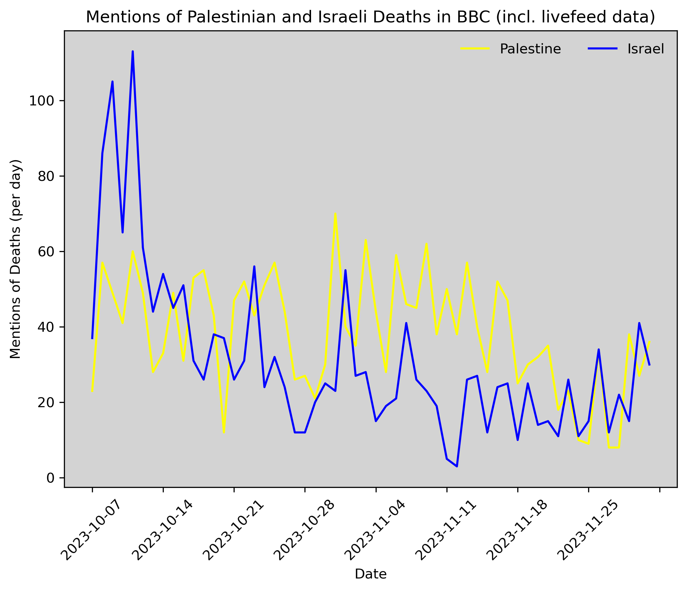

# Overview

This work aims to shed light on bias in BBC reporting on Palestine in a way that is both transparent and reproducible. We analyzed a total of 600 articles and 4000 livefeed posts on the BBC website between October 7, 2023 and December 2, 2023 in an attempt to surface the systematic disparity in how Palestinian and Israeli deaths are treated in the media. 

This analysis has been produced by Dana Najjar and Jan Lietava. It is an expansion of [Holly Jackson's work](https://github.com/hollyjackson/casualty_mentions_nyt) analyzing bias in media coverage of Israel and Palestine. 

The pipeline of the study is as follows:
1. We obtained source articles and livefeed posts from the BBC website by selecting relevant topics (see below for full list) and livefeeds. 
2. We parsed the individual sentences using the [Stanford CoreNLP](https://stanfordnlp.github.io/CoreNLP/) natural language processing pipeline.
3. Using the results from step 2, we identified sentences with mentions of death and **manually tagged each one of them** as referring to Palestinians, Israelis, neither or both. None of the tagging was performed automatically.

The raw annotated sentences can be found in `./nlp/fatality_counts/summary/`.

It was published by [Mona Chalabi](https://monachalabi.com/) in two parts:
1. ["Mentions of Israeli and Palestinian Deaths in BBC News Coverage" on the 29th of December, 2023.](https://www.instagram.com/monachalabi/p/C1Zv_gMu3AI/?hl=en)
2. ["Biases in the Language of BBC News Coverage" on the 30th of December, 2023.](https://www.instagram.com/monachalabi/p/C1cWSKCupsB/?hl=en)


# Source data

Posts from the BBC were obtained from two sources:
1. Articles published to specific topics
2. Livefeed articles

We are not authorized to include all the full raw article data in the repository, but do provide the reference jsons for obtaining them directly.

To validate that our sample of scraped articles is representative of the majority of published work by the BBC (since articles can be published outside of our selected topics/livefeeds) on the topic of Palestine since October 7, we also scraped articles using the search functionality on the website using several relevant search terms (Palestine/Israel/Gaza). More than 90% of all articles found using the search were present in our dataset. 

## Set up and requirements
To run the analysis, simply clone the repository and run ```pip3 install -r requirements.txt```

## 1. Articles and Livefeeds
Due to the limitations of the BBC search (limited to only 30 page results), we obtained articles through the use of topics. Topics are a BBC functionality that allows for articles to be posted related to 'themes' and have no time/number limit. We scraped data from the following 6 topics: 
* [Gaza](https://www.bbc.com/news/topics/cgv64vq5z82t)
* [Israel](https://www.bbc.com/news/topics/c302m85q5ljt)
* [Israel and the Palestinians](https://www.bbc.com/news/topics/c207p54m4rqt)
* [Israel-Gaza war](https://www.bbc.com/news/topics/c2vdnvdg6xxt)
* [Hamas](https://www.bbc.com/news/topics/cnx753jen5zt)
* [Palestinian Territories](https://www.bbc.com/news/topics/cdl8n2eder8t)

These are included in the ```./data/topics.json``` file. 

Livefeeds are a format that allow for multiple, smaller, blog-style posts over a longer period of time (usually 1-3 days). We collected livefeeds that covered the period from October 7, 2023 to December 2, 2023. This was done through the livefeeds themselves (they generally link to the next continuation), but also through Google advanced search, which allowed us to find the results between specific dates, with a specific URL.

All the livefeeds that were used can be found in ```./data/livefeeds.json```. 
Between October 7, 2023 and December 2, 2023, we collected 672 articles and 4404 invididual posts from 29 livefeeds. 

To scrape the articles and livefeeds, run ```./general/scraping.py```. It is also possible to scrape individual articles/topics using the ```BBCArticle``` and ```BBCScraper``` class respectively.

# Pre-processing

The python notebook in ```./nlp/preprocessing.ipynb``` provides the scripts and code for preparing the raw article data into a format that is processable by the (Stanford CoreNLP package)[https://stanfordnlp.github.io/CoreNLP/]. 

After pre-processing using the above, run the following, replacing ```path/to/``` with your specific path to the NLP package after having downloaded it:

```
export CLASSPATH=$CLASSPATH:/path/to/stanford-corenlp-4.5.5/*:
java edu.stanford.nlp.pipeline.StanfordCoreNLP -annotators tokenize,ssplit,pos,lemma,ner,depparse -filelist all-files.txt -outputFormat json -outputDirectory ./results
```

This will generate results files in the ```./nlp/results/``` directory for each article. 

# Annotating the sentences

We used the same process as seen [here](https://github.com/hollyjackson/casualty_mentions_nyt#3-automated-and-manual-tagging), copying the text with a few small modifications (highlighted in bold).

We used linguistic annotations from the Stanford CoreNLP preprocessing and extracted sentences which contain mentions of death using a pre-compiled word bank. **However, we widened the "detection" by also including adjectives (rather than just verbs)**. The classification is otherwise identical: each sentence is tagged as either Palestinian, Israeli, both (if the sentence contains multiple victims), or none (if the sentence is unrelated to Palestine and Israel, or if it occurred before October 7, 2023). 

To begin manual annotations, run  ```./nlp/postprocessing.ipynb```. 

The data were manually tagged according to the following general rules:

* The victim must be Palestinian or Israeli or the death otherwise occured in the West Bank, Gaza, or Israel ('48 lands)
* The mention cannot be speculative (i.e. "He may die") and must have already happened
* The mention must refer to a fatality event that has happened on or since 10/7
* Injuries do not count
  
There is also an option for 'Next', if the sentence contains insufficient details for classification. If the annotator selects 'Next', the sentence is shown in context with the three preceding and three following sentences. If there is still insufficient details, the annotator can select 'Next' one more time to display the entire text of the article, where 'none' can still be assigned if it is still uncertain. 

## Results

## Casualty mentions over time



## Word bank analysis

| *Word that appears in the article* | *In reference to Israelis* | *In reference to Palestinians* |
|------------------------------------|----------------------------|--------------------------------|
| mother/grandmother                 | 51                         | 32                             |
| daughter/granddaughter             | 35                         | 15                             |
| father/grandfather                 | 33                         | 9                              |
| husband                            | 30                         | 5                              |
| son/grandson                       | 25                         | 11                             |
| wife                               | 10                         | 24                             |
| killed                             | 1066                       | 1630                           |
| died                               | 82                         | 201                            |
| murder(ed)                         | 101                        | 1                              |
| massacre(ed)                       | 23                         | 1                              |
| slaughter(ed)                      | 20                         | 0                              |
 
Below is a list of sentences which use both "killed" and "died":

* [*"The ministry says more than 15,200 people have died in the war in Gaza, sparked by Hamas's attack on Israel on 7 October that killed at least 1,200 people."*](http://bbc.co.uk/news/uk-67604423)
* [*"About 700 people have been killed in Israel since Hamas launched its attack on Saturday, with a further 500 having died in Gaza in retaliatory air strikes."*](http://bbc.co.uk/news/business-67052562)
* [*"At least 1,300 Israelis were killed, and over 1,400 Palestinians have died in air strikes on Gaza."*](http://bbc.co.uk/news/world-middle-east-67087583)
* [*"Some 1,200 people have been killed in Israel, while more than 1,000 have died in retaliatory air strikes on Gaza."*](http://bbc.co.uk/news/uk-67080828)
* [*"More than 700 people have been killed in Israel since Saturday and over 500 people have died in Gaza."*](http://bbc.co.uk/news/uk-scotland-glasgow-west-67056240)
* [*"Israelis  reject  any  comparison  between  the  way  Hamas  kills  civilians  and  the  way  Palestinian  civilians  die  in  their  air  strikes."*](http://bbc.co.uk/news/world-middle-east-67065205)
* [*"About 900 people have died in Israel since Saturday's surprise attack, while retaliatory strikes on Gaza have killed almost 690."*](http://bbc.co.uk/news/uk-67061369)

# Bias, sources of error and limitations

## Bias in machine learning methods

There are many studies highlighting the inherent bias (racist, Islamophobic, sexist, and other forms) present in machine learning models, and specifially natural language processing, which will also be present in the Stanford CoreNLP linguistic pipeline ([Jacskon, 2023](https://github.com/hollyjackson/casualty_mentions_nyt); Abid et al., 2021; Bolukbasi et al., 2016; Bordia and Bowman, 2019; Lu et al., 2020; Nadeem et al., 2020; Shearer et al., 2019; Sheng et al., 2019; Garimella et al., 2019). Hence, considering this structural, and inherent, anti-Palestinian bias in machine learning techniques, there may be further and deeper bias which we are not capturing. Furthermore, these biases are also present in the manual processes of annotation, which does also affect the resulting data (Lee, N.T., 2018).

Another source of error can be the disagreement, or lack of consistency, with annotation. To try and mitigate this, during annotation we made sure to overlap samples of the data between the two core annotators, and cross check the results, as well as having a third independent person annotate a random sample of the data for verification. 

## Limitations
Although there are limitations to the study, we do not believe they undermine the rigor of the analysis or the validity of the results.
* Due to the limited direct access to all historical BBC articles, our method does not necessarily capture all articles/posts published relating to Israel/Palestine since October 7, 2023. However, the size of our dataset (~5000 posts/articles) highlights a very large, representative sample. We also scraped different search terms from the BBC website directly, and found 90%+ of those articles present in our dataset between October 7 and December 2. 
* Since we use a manual word bank for part of the selection, there are references to death that we may not have detected. To mitigate for this, we also read through some of the articles/sentences in full (especially at the start of annotation) to try and spot any missed mentions.
