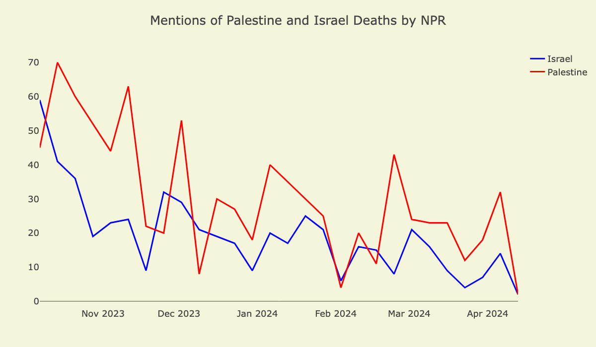
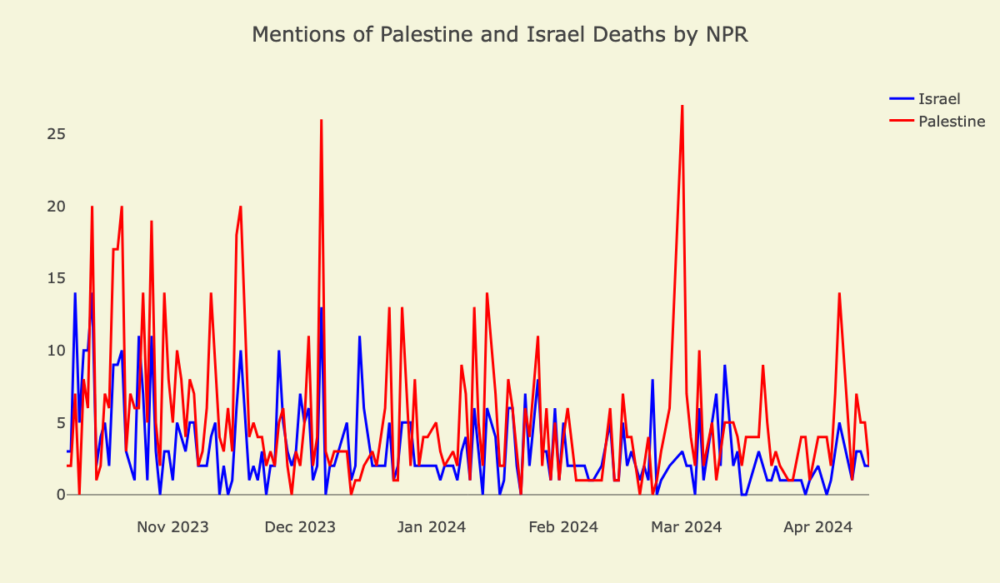

# Analysing the bias in NPR reporting of Palestine

# Overview

This work aims to shed light on bias in NPR reporting on Palestine in a way that is both transparent and reproducible. It mirrors the methodology used to [analyze bias in BBC coverage of Palestine](https://github.com/liet-git/bbc-bias/). We analyzed a total of 500 articles published on the NPR website between October 7, 2023 and April 17, 2024. We did not analyze audio transcripts since NPR does not make them available.

This analysis has been produced by Dana Najjar and Jan Lietava. It is an expansion of [Holly Jackson's work](https://github.com/hollyjackson/casualty_mentions_nyt) analyzing bias in media coverage of Israel and Palestine. 

The pipeline of the study is as follows:
1. We sraped all articles posted on the [Middle East Crisis page](https://www.npr.org/series/1205445976/middle-east-crisis)
2. We parsed the individual sentences using the [Stanford CoreNLP](https://stanfordnlp.github.io/CoreNLP/) natural language processing pipeline.
3. Using the results from step 2, we identified sentences with mentions of death and **manually tagged each one of them** as referring to Palestinians, Israelis, neither or both. None of the tagging was performed automatically.

## Set up and requirements
To run the analysis, simply clone the repository and run ```pip3 install -r requirements.txt```

# Pre-processing

The python notebook in ```./nlp/preprocessing.ipynb``` provides the scripts and code for preparing the raw article data into a format that is processable by the (Stanford CoreNLP package)[https://stanfordnlp.github.io/CoreNLP/]. 

After pre-processing using the above, run the following, replacing ```path/to/``` with your specific path to the NLP package after having downloaded it:

```
export CLASSPATH=$CLASSPATH:/path/to/stanford-corenlp-4.5.5/*:
java edu.stanford.nlp.pipeline.StanfordCoreNLP -annotators tokenize,ssplit,pos,lemma,ner,depparse -filelist all-files.txt -outputFormat json -outputDirectory ./results
```

This will generate results files in the ```./nlp/results/``` directory for each article. 

# Annotating the sentences

We used the same process as seen [here](https://github.com/hollyjackson/casualty_mentions_nyt#3-automated-and-manual-tagging), copying the text with a few small modifications (highlighted in bold).

We used linguistic annotations from the Stanford CoreNLP preprocessing and extracted sentences which contain mentions of death using a pre-compiled word bank. **However, we widened the "detection" by also including adjectives (rather than just verbs)**. The classification is otherwise identical: each sentence is tagged as either Palestinian, Israeli, both (if the sentence contains multiple victims), or none (if the sentence is unrelated to Palestine and Israel, or if it occurred before October 7, 2023). 

To begin manual annotations, run  ```./nlp/postprocessing.ipynb```. 

The data were manually tagged according to the following general rules:

* The victim must be Palestinian or Israeli or the death otherwise occured in the West Bank, Gaza, or Israel ('48 lands)
* The mention cannot be speculative (i.e. "He may die") and must have already happened
* The mention must refer to a fatality event that has happened on or since 10/7
* Injuries do not count
  
There is also an option for 'Next', if the sentence contains insufficient details for classification. If the annotator selects 'Next', the sentence is shown in context with the three preceding and three following sentences. If there is still insufficient details, the annotator can select 'Next' one more time to display the entire text of the article, where 'none' can still be assigned if it is still uncertain. 

## Results


## Casualty mentions over time (grouped weekly)



## Casualty mentions over time (daily)



# Bias, sources of error and limitations

## Bias in machine learning methods

There are many studies highlighting the inherent bias (racist, Islamophobic, sexist, and other forms) present in machine learning models, and specifially natural language processing, which will also be present in the Stanford CoreNLP linguistic pipeline ([Jacskon, 2023](https://github.com/hollyjackson/casualty_mentions_nyt); Abid et al., 2021; Bolukbasi et al., 2016; Bordia and Bowman, 2019; Lu et al., 2020; Nadeem et al., 2020; Shearer et al., 2019; Sheng et al., 2019; Garimella et al., 2019). Hence, considering this structural, and inherent, anti-Palestinian bias in machine learning techniques, there may be further and deeper bias which we are not capturing. Furthermore, these biases are also present in the manual processes of annotation, which does also affect the resulting data (Lee, N.T., 2018).

Another source of error can be the disagreement, or lack of consistency, with annotation. To try and mitigate this, during annotation we made sure to overlap samples of the data between the two core annotators, and cross check the results, as well as having a third independent person annotate a random sample of the data for verification. 

## Limitations
* Although there are limitations to the study, we do not believe they undermine the rigor of the analysis or the validity of the results.
* Since NPR does not post transcripts for all audio content, we were only able to analyze news articles posted on the website 
* Since we use a manual word bank for part of the selection, there are references to death that we may not have detected. To mitigate for this, we also read through some of the articles/sentences in full (especially at the start of annotation) to try and spot any missed mentions.

