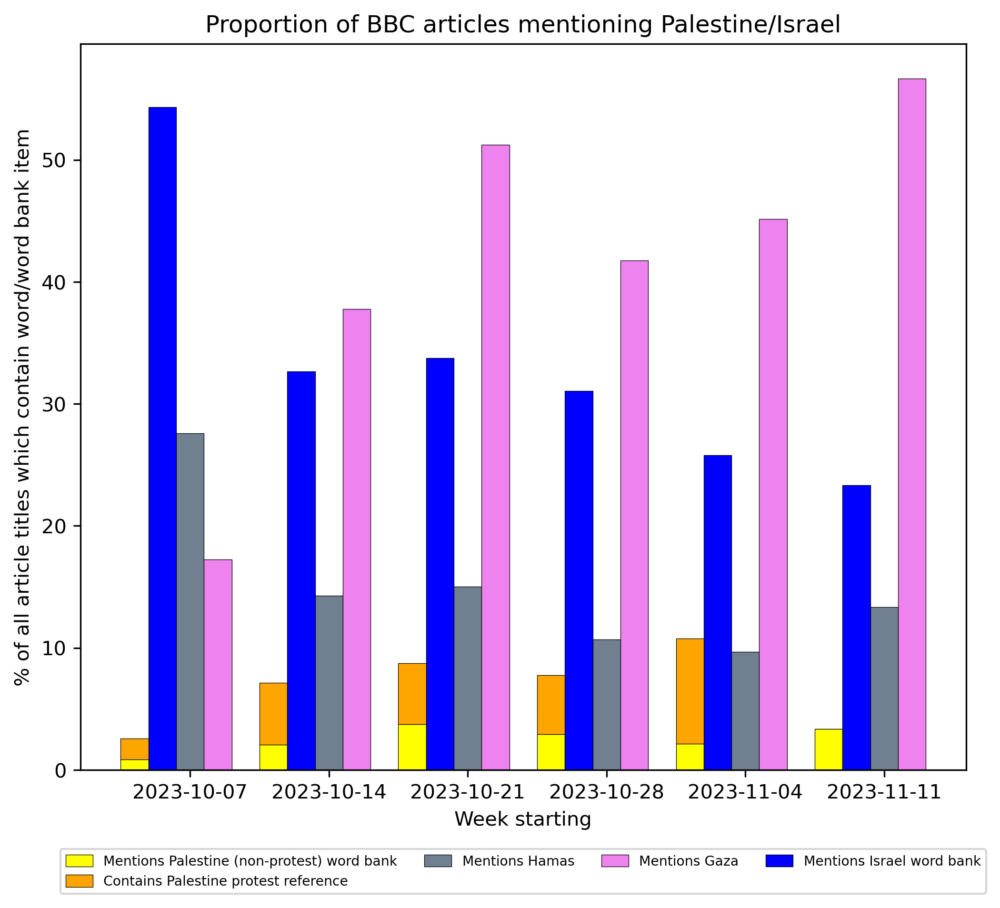

# Analysing the bias in BBC reporting of Palestine
The following code can be used to gather information from BBC articles regarding several topics (a form of grouping on the BBC website). These topics can be found in ```./data/topics.json```. 

Currently included topics:
The following topics are included:
* [Gaza](https://www.bbc.com/news/topics/cgv64vq5z82t)
* [Israel](https://www.bbc.com/news/topics/c302m85q5ljt)
* [Israel and the Palestinians](https://www.bbc.com/news/topics/c207p54m4rqt)
* [Israel-Gaza war](https://www.bbc.com/news/topics/c2vdnvdg6xxt)
* [Hamas](https://www.bbc.com/news/topics/cnx753jen5zt)
* [Palestinian Territories](https://www.bbc.com/news/topics/cdl8n2eder8t)

Latest update date: *2023-11-13*

## Set up and requirements
Simply clone the repoistory and run:
```pip3 install -r requirements.txt```

## Limitations

* Currently, only articles are supported (not 'live' articles, which are quite large, and often feature more continuous live news)
* The topics selected potentially do not cover all articles related to Palestine in the current period (i.e. there may be some published which are not tagged with a certain topic, though coverage seems quite good)

To do:
* add scraping for the 'search' function of BBC (would be relatively straightforward, but there is a 30 page limit, so would potentially have to include some more complex word partnering to get limited results and repeat).

### Usage

To simply collect all articles, from all topics defined in the above json, run  ```./general/scraping.py```. It is also possible to scrape individual articles/topics using the ```BBCArticle``` and ```BBCScraper``` class respectively.

## Analysis 

### Overview of dataset

In ```./data/summary_20231113.csv``` we have all the articles collected from the creation of the topic, until 2023-11-13 (please refer to 'latest update date' at the top of this page), with the following columns:
* date: date of article
* href: reference to news/topic url part of whole url
* text: the span texts of the article, containing all the text in list format
* title: the title of the article as shown in the topic
* title_from_page: the title of the article as shown when loaded (can differ to above, often longer)
* topic: the topic this article was found in (can be multiple)
* url: full url to the article

The ```./general/base_analysis.py``` contains a simple analysis looking at word count frequencies in the article titles, as well as plotting the mentions of Palestine/Israel/Gaza/Hamas with the following output:



The word banks used for each category are:
```
'palestine_word_bank' : ['Palestine', 'Palestinian', 'Palestinians'],
    'israel_word_bank' : ['Israel', 'Israeli', 'Israelis'],
    'hamas_word_bank' : ['Hamas'],
    'gaza_word_bank' : ['Gaza'],
}
```

For differentiating protest related mentions, I manually checked all the titles that contained the root ("palestine"). 

The processed csv files (containing the 520 articles between 2023-10-07 and 2023-11-13 with the word bank flags [True/False]) can be found in ```./outputs/articles_word_bank_full_20231007-20231113.csv``` and ```./outputs/articles_summary_word_bank.csv```, with the former containing the information at the article level, and the latter grouped by week.
